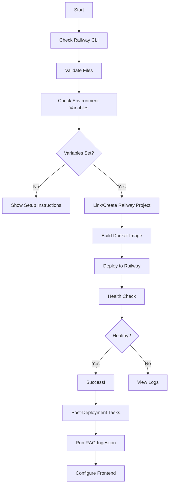

# CodeEcho - Railway Deployment Files Summary

This directory contains all files necessary for deploying CodeEcho backend to Railway.

## 📁 Deployment Files

### Core Configuration

| File                    | Purpose                                     | Required |
| ----------------------- | ------------------------------------------- | -------- |
| `Dockerfile`            | Multi-stage Docker build (Node.js + Python) | ✓ Yes    |
| `railway.json`          | Railway platform configuration              | ✓ Yes    |
| `.dockerignore`         | Excludes unnecessary files from build       | ✓ Yes    |
| `.env.railway.template` | Environment variables template              | ✓ Yes    |
| `deploy-railway.sh`     | Automated deployment script                 | ✓ Yes    |

### Documentation

| File                       | Purpose                   |
| -------------------------- | ------------------------- |
| `RAILWAY_DEPLOYMENT.md`    | Complete deployment guide |
| `RAILWAY_QUICK_START.md`   | Quick reference guide     |
| `RAILWAY_FILES_SUMMARY.md` | This file                 |

## 📦 What Gets Deployed

### Included in Deployment

```
✓ /backend               - Node.js API server
✓ /rag                   - Python RAG scripts
✓ /orchestrate          - Agent configurations
✓ /runner               - Docker configs
✓ /sandbox              - Safe file storage
✓ main.py               - Python voice agent
✓ graph.py              - LangGraph definitions
✓ requirements.txt      - Python dependencies
✓ docker-compose.yml    - Local development setup
```

### Excluded from Deployment

```
✗ /frontend             - Deploy separately to Vercel
✗ /node_modules         - Installed during build
✗ /.git                 - Version control
✗ /Generated_Content    - Runtime generated files
✗ /chat_gpt             - User sandbox (created at runtime)
```

## 🚀 Quick Deploy

```bash
# Make script executable
chmod +x deploy-railway.sh

# Run deployment
./deploy-railway.sh
```

## 📋 Prerequisites

Before deployment, ensure you have:

1. **Railway CLI** installed and authenticated
2. **Environment variables** ready:
   - MongoDB URI
   - Qdrant URL + API Key
   - IBM Watsonx.ai credentials
   - JWT secret

See `.env.railway.template` for complete list.

## 🔧 File Details

### Dockerfile

Multi-stage Docker image that includes:

- **Base**: Node.js 18 Alpine
- **Python**: Python 3 with pip
- **Dependencies**: System libraries for audio, networking, compilation
- **Layers**:
  1. Backend Node.js dependencies (`npm ci`)
  2. Python dependencies (`pip install`)
  3. Application code copy
  4. Health checks and runtime config

**Build Context**: Project root (`CodeEcho-main/`)

### railway.json

Configures Railway platform:

- Build strategy: Dockerfile
- Start command: `node backend/index.js`
- Restart policy: On failure with retries
- Replicas: 1 (adjust for scaling)

### .dockerignore

Excludes from Docker build:

- Frontend files (entire `/frontend` directory)
- Node modules (reinstalled during build)
- Development files (.env, logs, cache)
- Version control (.git)
- Platform-specific configs (vercel.json)

### .env.railway.template

Template for environment variables with:

- Required variables clearly marked
- Optional variables documented
- Default values provided where applicable
- Grouped by service (Database, Watsonx, GitHub, etc.)
- Comments explaining each variable

**Usage**: Reference when setting Railway variables via CLI or dashboard

### deploy-railway.sh

Automated deployment script that:

1. Checks prerequisites (Railway CLI, authentication)
2. Validates project structure
3. Displays required environment variables
4. Prompts for confirmation
5. Links to Railway project (or creates new)
6. Deploys to Railway
7. Shows post-deployment steps
8. Provides next actions and useful commands

**Features**:

- Color-coded output
- Step-by-step guidance
- Error handling
- Environment variable helpers
- Post-deployment checklist

## 🏗️ Architecture

```
┌─────────────────────────────────────┐
│     Railway Container (Docker)       │
├─────────────────────────────────────┤
│  Node.js Backend (Port 5000)        │
│  ├─ Express REST API                │
│  ├─ Socket.IO WebSocket             │
│  └─ MongoDB Connection              │
├─────────────────────────────────────┤
│  Python Services                    │
│  ├─ RAG Ingestion (rag/ingest.py)  │
│  ├─ Embeddings (rag/embedder.py)   │
│  └─ Qdrant Integration              │
├─────────────────────────────────────┤
│  AI Agents                          │
│  ├─ LangGraph (graph.py)           │
│  ├─ Voice Agent (main.py)          │
│  └─ Orchestrate Configs            │
└─────────────────────────────────────┘
         ↓                    ↓
    MongoDB            Qdrant Cloud
    (Railway or         (External)
     Atlas)
         ↓
   Watsonx.ai
   (IBM Cloud)
```

## 📊 Deployment Flow



## 🔐 Security Notes

### Sensitive Files

These files contain or reference sensitive data:

- `.env` (never commit, use `.gitignore`)
- `.env.railway.template` (safe to commit, contains no secrets)
- Environment variables set in Railway (stored securely by Railway)

### Best Practices

1. **Never commit** `.env` files with actual secrets
2. **Use Railway dashboard** for sensitive variables
3. **Rotate secrets** regularly (JWT_SECRET, API keys)
4. **Limit access** to Railway project
5. **Enable 2FA** on Railway account

## 🧪 Testing Deployment

After deployment:

```bash
# 1. Check health
curl https://your-app.railway.app/health

# 2. Test API root
curl https://your-app.railway.app/

# 3. View logs
railway logs -f

# 4. Check status
railway status
```

## 📝 Maintenance

### Updating Code

```bash
# After code changes
git push origin main

# Railway auto-deploys (if GitHub integration enabled)
# Or manually:
railway up
```

### Updating Environment Variables

```bash
# Via CLI
railway variables set KEY="new-value"
railway restart

# Or via Dashboard
railway open
# → Navigate to Variables tab
```

### Viewing Logs

```bash
# Real-time logs
railway logs -f

# Recent logs (last 100 lines)
railway logs --tail 100

# Search logs
railway logs | grep "error"
```

### Scaling

```bash
# Open dashboard
railway open

# Go to Settings → Resources
# Adjust:
# - Memory (MB)
# - CPU (millicores)
# - Replicas (horizontal scaling)
```

## 🔗 Related Documentation

| Document                                                       | Description               |
| -------------------------------------------------------------- | ------------------------- |
| [RAILWAY_DEPLOYMENT.md](./RAILWAY_DEPLOYMENT.md)               | Complete deployment guide |
| [RAILWAY_QUICK_START.md](./RAILWAY_QUICK_START.md)             | Quick reference           |
| [ARCHITECTURE.md](./ARCHITECTURE.md)                           | System architecture       |
| [backend/README.deployment.md](./backend/README.deployment.md) | Backend specifics         |
| [docs/setup-guide.md](./docs/setup-guide.md)                   | Development setup         |

## 🆘 Troubleshooting

### Deployment Fails

1. Check Railway logs: `railway logs`
2. Verify Dockerfile syntax
3. Ensure all required files exist
4. Check environment variables

### Build Errors

1. Verify dependencies in `requirements.txt` and `package.json`
2. Check Docker build context
3. Review `.dockerignore` excludes

### Runtime Errors

1. Check environment variables: `railway variables`
2. Test external services (MongoDB, Qdrant)
3. Verify network connectivity
4. Review application logs

See [RAILWAY_DEPLOYMENT.md](./RAILWAY_DEPLOYMENT.md) for detailed troubleshooting.

## 📞 Support

- **Railway Docs**: [docs.railway.app](https://docs.railway.app)
- **Railway Discord**: [discord.gg/railway](https://discord.gg/railway)
- **Railway Support**: [help.railway.app](https://help.railway.app)

---

**Ready to deploy?** Start with [RAILWAY_QUICK_START.md](./RAILWAY_QUICK_START.md) or run `./deploy-railway.sh`! 🚀
