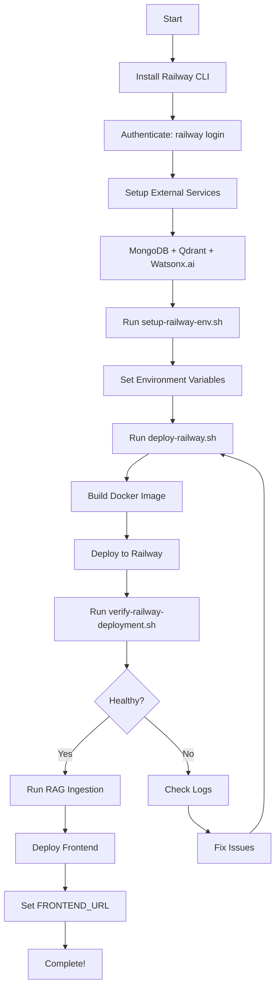

# 🚂 CodeEcho - Railway Deployment Package

> **Complete backend deployment package for Railway.app**  
> Includes: Backend API, RAG System, Python Agents, Orchestrate, Runner, Sandbox  
> **Excludes: Frontend** (deploy separately to Vercel/Netlify)

---

## 📦 What's Included

This package contains everything needed to deploy CodeEcho backend infrastructure to Railway:

```
✅ Node.js Backend      - Express REST API + Socket.IO WebSockets
✅ Python RAG System    - Document ingestion + Vector embeddings
✅ AI Agents           - LangGraph-based code generation agents
✅ Orchestrate         - Agent configuration and workflows
✅ Runner              - Docker-based code execution environment
✅ Sandbox             - Safe file storage and execution
✅ Deployment Scripts  - Automated setup and deployment
✅ Documentation       - Complete guides and references
```

---

## 🚀 Quick Start (5 Minutes)

### Option 1: Automated (Recommended)

```bash
# 1. Install Railway CLI
npm i -g @railway/cli

# 2. Authenticate
railway login

# 3. Setup environment variables (interactive wizard)
./setup-railway-env.sh

# 4. Deploy everything
./deploy-railway.sh

# 5. Verify deployment
./verify-railway-deployment.sh
```

### Option 2: Manual

```bash
# Install Railway CLI
npm i -g @railway/cli
railway login

# Initialize project
railway init --name codeecho-backend

# Set environment variables
railway variables set MONGODB_URI="..."
railway variables set QDRANT_URL="..."
railway variables set QDRANT_API_KEY="..."
railway variables set WATSONX_API_KEY="..."
railway variables set WATSONX_URL="https://us-south.ml.cloud.ibm.com"
railway variables set WATSONX_PROJECT_ID="..."
railway variables set JWT_SECRET="$(openssl rand -base64 32)"
railway variables set NODE_ENV="production"

# Deploy
railway up

# Run RAG ingestion
railway run python3 rag/ingest.py
```

---

## 📁 Package Contents

### Deployment Files

| File                    | Description                                       |
| ----------------------- | ------------------------------------------------- |
| `Dockerfile`            | Multi-stage Docker build (Node.js + Python)       |
| `railway.json`          | Railway platform configuration                    |
| `.dockerignore`         | Build exclusions (includes frontend exclusion)    |
| `.env.railway.template` | Environment variables template with documentation |
| `nixpacks.toml`         | Alternative to Dockerfile (Nixpacks build)        |

### Scripts

| Script                         | Purpose                                 |
| ------------------------------ | --------------------------------------- |
| `deploy-railway.sh`            | Main deployment automation script       |
| `setup-railway-env.sh`         | Interactive environment variable wizard |
| `verify-railway-deployment.sh` | Post-deployment health checks           |

### Documentation

| Document                   | Description                          |
| -------------------------- | ------------------------------------ |
| `RAILWAY_DEPLOYMENT.md`    | Complete deployment guide (detailed) |
| `RAILWAY_QUICK_START.md`   | Quick reference guide                |
| `RAILWAY_CHECKLIST.md`     | Step-by-step deployment checklist    |
| `RAILWAY_FILES_SUMMARY.md` | Package contents overview            |
| `README_RAILWAY.md`        | This file                            |

### Application Structure

```
backend/                 ← Node.js API server
├── config/             ← Database configurations
├── controllers/        ← Request handlers
├── routes/             ← API routes
├── services/           ← Business logic
├── models/             ← Data models
├── index.js            ← Entry point
└── package.json        ← Dependencies

rag/                     ← Python RAG system
├── embedder.py         ← Watsonx.ai embeddings
├── ingest.py           ← Document ingestion
├── test_rag.py         ← RAG testing
└── verify_qdrant.py    ← Qdrant verification

orchestrate/             ← Agent configurations
├── agents.yaml         ← Agent definitions
└── flows.md            ← Workflow documentation

runner/                  ← Code execution environment
├── Dockerfile          ← Runner container config
└── README.md           ← Runner documentation

sandbox/                 ← Safe file storage
└── (created at runtime)

Python Agents:
├── main.py             ← Voice-driven agent (legacy)
└── graph.py            ← LangGraph state machine

Configuration:
├── requirements.txt    ← Python dependencies
├── docker-compose.yml  ← Local development
└── package.json        ← (in backend/)
```

---

## 🔑 Required Environment Variables

### Essential (Must Set Before Deployment)

```bash
MONGODB_URI              # MongoDB connection string
QDRANT_URL              # Qdrant Cloud cluster URL
QDRANT_API_KEY          # Qdrant authentication
JWT_SECRET              # JWT signing secret (generate with openssl)
NODE_ENV                # production
WATSONX_API_KEY         # IBM Cloud API key
WATSONX_URL             # Watsonx.ai endpoint
WATSONX_PROJECT_ID      # Watsonx.ai project ID
```

### Optional (Add as Needed)

```bash
FRONTEND_URL            # Frontend URL for CORS (add after frontend deployment)
GITHUB_TOKEN            # GitHub personal access token
GITHUB_OWNER            # GitHub repository owner
GITHUB_REPO             # GitHub repository name
OPENAI_API_KEY          # OpenAI API key (fallback)
WATSONX_MODEL           # Custom model name
WATSONX_EMBEDDING_MODEL # Custom embedding model
```

See `.env.railway.template` for complete documentation.

---

## 🏗️ Architecture

```
┌───────────────────────────────────────────────────────┐
│              Railway Container (Docker)                │
├───────────────────────────────────────────────────────┤
│                                                        │
│  ┌─────────────────────────────────────────────┐     │
│  │  Node.js Backend (Express + Socket.IO)      │     │
│  │  Port: 5000                                  │     │
│  │  ├─ REST API                                 │     │
│  │  ├─ WebSocket Server                         │     │
│  │  └─ MongoDB Client                           │     │
│  └─────────────────────────────────────────────┘     │
│                                                        │
│  ┌─────────────────────────────────────────────┐     │
│  │  Python RAG Services                         │     │
│  │  ├─ Embeddings (watsonx.ai)                 │     │
│  │  ├─ Document Ingestion                      │     │
│  │  └─ Vector Search (Qdrant)                  │     │
│  └─────────────────────────────────────────────┘     │
│                                                        │
│  ┌─────────────────────────────────────────────┐     │
│  │  Python AI Agents                            │     │
│  │  ├─ LangGraph Orchestration                 │     │
│  │  ├─ Code Generation                         │     │
│  │  └─ Command Execution                       │     │
│  └─────────────────────────────────────────────┘     │
│                                                        │
└───────────────────────────────────────────────────────┘
         │              │              │
         ▼              ▼              ▼
    ┌────────┐    ┌─────────┐    ┌──────────┐
    │MongoDB │    │ Qdrant  │    │Watsonx.ai│
    │(Railway│    │ Cloud   │    │(IBM Cloud)│
    │or Atlas)│   │         │    │          │
    └────────┘    └─────────┘    └──────────┘
```

---

## 📖 Documentation Guide

Start here based on your needs:

| If you want to...         | Read this                                                                  |
| ------------------------- | -------------------------------------------------------------------------- |
| **Deploy quickly**        | [RAILWAY_QUICK_START.md](./RAILWAY_QUICK_START.md)                         |
| **Understand everything** | [RAILWAY_DEPLOYMENT.md](./RAILWAY_DEPLOYMENT.md)                           |
| **Follow step-by-step**   | [RAILWAY_CHECKLIST.md](./RAILWAY_CHECKLIST.md)                             |
| **See what's included**   | [RAILWAY_FILES_SUMMARY.md](./RAILWAY_FILES_SUMMARY.md)                     |
| **Troubleshoot issues**   | [RAILWAY_DEPLOYMENT.md](./RAILWAY_DEPLOYMENT.md) (Troubleshooting section) |

---

## 🎯 Deployment Workflow



---

## ✅ Pre-Flight Checklist

Before deployment, ensure you have:

- [ ] Railway account ([railway.app](https://railway.app))
- [ ] Railway CLI installed (`npm i -g @railway/cli`)
- [ ] MongoDB ready (Railway plugin or MongoDB Atlas)
- [ ] Qdrant Cloud cluster created ([cloud.qdrant.io](https://cloud.qdrant.io))
- [ ] IBM Watsonx.ai credentials ([cloud.ibm.com](https://cloud.ibm.com))
- [ ] All required environment variables ready
- [ ] Project files complete (run from project root)

See [RAILWAY_CHECKLIST.md](./RAILWAY_CHECKLIST.md) for complete checklist.

---

## 🚦 Post-Deployment Steps

After successful deployment:

### 1. Run RAG Ingestion

Index documentation for vector search:

```bash
railway run python3 rag/ingest.py
```

### 2. Verify Health

```bash
# Get deployment URL
railway status

# Test health endpoint
curl https://your-app.railway.app/health

# Expected response:
# {"status":"healthy","database":"connected","timestamp":"..."}
```

### 3. Connect Frontend

After deploying frontend to Vercel/Netlify:

```bash
# Update backend CORS
railway variables set FRONTEND_URL="https://your-frontend.vercel.app"
railway restart
```

### 4. Monitor Deployment

```bash
# View real-time logs
railway logs -f

# Check status
railway status

# Open dashboard
railway open
```

---

## 🐛 Troubleshooting

### Quick Fixes

| Issue                    | Solution                                          |
| ------------------------ | ------------------------------------------------- |
| Build fails              | Check `railway logs` for specific error           |
| MongoDB connection error | Verify `MONGODB_URI` format and credentials       |
| Qdrant timeout           | Check `QDRANT_URL` and `QDRANT_API_KEY`           |
| Watsonx.ai auth error    | Verify `WATSONX_API_KEY` and `WATSONX_PROJECT_ID` |
| CORS issues              | Set `FRONTEND_URL` and restart                    |
| Health check fails       | Check logs: `railway logs -f`                     |

### Common Commands

```bash
# View logs
railway logs -f

# Check environment
railway variables

# Restart service
railway restart

# Run command in Railway environment
railway run <command>

# Redeploy
railway up
```

See [RAILWAY_DEPLOYMENT.md](./RAILWAY_DEPLOYMENT.md) for detailed troubleshooting.

---

## 📊 What's NOT Included

This package **does NOT include**:

- ❌ **Frontend** - Deploy separately to Vercel/Netlify using `/frontend` directory
- ❌ **Database setup** - Use Railway MongoDB plugin or external MongoDB Atlas
- ❌ **Qdrant setup** - Use Qdrant Cloud (free tier available)
- ❌ **Watsonx.ai setup** - Use IBM Cloud watsonx.ai service

These are **external dependencies** that must be configured separately.

---

## 🔒 Security Notes

### Best Practices

1. **Never commit secrets** - Use Railway environment variables
2. **Rotate secrets regularly** - JWT_SECRET, API keys
3. **Use strong JWT_SECRET** - Generate with `openssl rand -base64 32`
4. **Limit GitHub token permissions** - Only grant necessary scopes
5. **Use Railway secrets** - Not plain environment variables for sensitive data
6. **Enable 2FA** - On Railway, MongoDB, Qdrant, and IBM Cloud accounts
7. **Monitor logs** - Check for unauthorized access attempts
8. **Keep dependencies updated** - Regularly run `npm audit` and `pip check`

### Secrets Management

```bash
# Generate secure JWT secret
openssl rand -base64 32

# Set secrets via Railway CLI (more secure than dashboard)
railway variables set JWT_SECRET="$(openssl rand -base64 32)"

# Never log secrets
# Use environment variables, not console.log or print
```

---

## 🔄 Updates and Maintenance

### Regular Updates

```bash
# Update code
git pull origin main

# Redeploy
railway up

# Or enable auto-deploy from GitHub in Railway dashboard
```

### Dependency Updates

```bash
# Node.js dependencies
cd backend
npm update
npm audit fix

# Python dependencies
pip install --upgrade -r requirements.txt
```

### Monitoring

```bash
# Check resource usage
railway status

# View metrics
railway open
# → Go to Metrics tab

# Set up alerts in Railway dashboard
```

---

## 📞 Support

### Getting Help

1. **Check documentation**:

   - [RAILWAY_DEPLOYMENT.md](./RAILWAY_DEPLOYMENT.md) - Complete guide
   - [RAILWAY_QUICK_START.md](./RAILWAY_QUICK_START.md) - Quick reference
   - [RAILWAY_CHECKLIST.md](./RAILWAY_CHECKLIST.md) - Step-by-step

2. **Review logs**:

   ```bash
   railway logs -f
   ```

3. **Check health**:

   ```bash
   curl https://your-app.railway.app/health
   ```

4. **Railway resources**:

   - Docs: [docs.railway.app](https://docs.railway.app)
   - Discord: [discord.gg/railway](https://discord.gg/railway)
   - Support: [help.railway.app](https://help.railway.app)

5. **External services**:
   - MongoDB: [docs.mongodb.com](https://docs.mongodb.com)
   - Qdrant: [qdrant.tech/documentation](https://qdrant.tech/documentation)
   - Watsonx.ai: [ibm.com/docs/watsonx-as-a-service](https://www.ibm.com/docs/en/watsonx-as-a-service)

---

## 🎓 Learning Resources

### Railway

- [Railway Docs](https://docs.railway.app)
- [Railway Blog](https://blog.railway.app)
- [Railway Templates](https://railway.app/templates)

### Docker

- [Dockerfile Best Practices](https://docs.docker.com/develop/develop-images/dockerfile_best-practices/)
- [Multi-stage Builds](https://docs.docker.com/build/building/multi-stage/)

### Services

- [MongoDB University](https://university.mongodb.com)
- [Qdrant Tutorials](https://qdrant.tech/documentation/tutorials/)
- [IBM Watsonx.ai Docs](https://www.ibm.com/docs/en/watsonx-as-a-service)

---

## 🎉 Success Checklist

Your deployment is complete when:

- ✅ Health endpoint returns `{"status":"healthy"}`
- ✅ Database connection shows `"connected"`
- ✅ RAG ingestion completed successfully
- ✅ No errors in logs (`railway logs`)
- ✅ Frontend connected (if applicable)
- ✅ API endpoints responding correctly
- ✅ WebSocket connections working
- ✅ Monitoring enabled
- ✅ Backups configured
- ✅ Team has access to Railway project

---

## 📝 Quick Command Reference

```bash
# Setup
npm i -g @railway/cli        # Install CLI
railway login                 # Authenticate
./setup-railway-env.sh       # Configure environment

# Deploy
./deploy-railway.sh          # Automated deployment
railway up                    # Manual deployment

# Monitor
railway logs -f              # Real-time logs
railway status               # Check status
railway open                 # Open dashboard

# Manage
railway variables            # List variables
railway variables set K=V    # Set variable
railway restart              # Restart service
railway run <cmd>            # Run command

# Verify
./verify-railway-deployment.sh  # Health checks
curl https://your-app/health     # Test health
```

---

## 🚀 Ready to Deploy?

1. **Quick Start**: Run `./deploy-railway.sh`
2. **Guided Setup**: Run `./setup-railway-env.sh` first
3. **Manual Setup**: See [RAILWAY_DEPLOYMENT.md](./RAILWAY_DEPLOYMENT.md)
4. **Step-by-step**: Follow [RAILWAY_CHECKLIST.md](./RAILWAY_CHECKLIST.md)

---

**Package Version**: 1.0.0  
**Last Updated**: November 23, 2025  
**Deployment Target**: Railway.app  
**Node.js Version**: 18.x  
**Python Version**: 3.10.x

**Happy Deploying! 🚂🚀**
